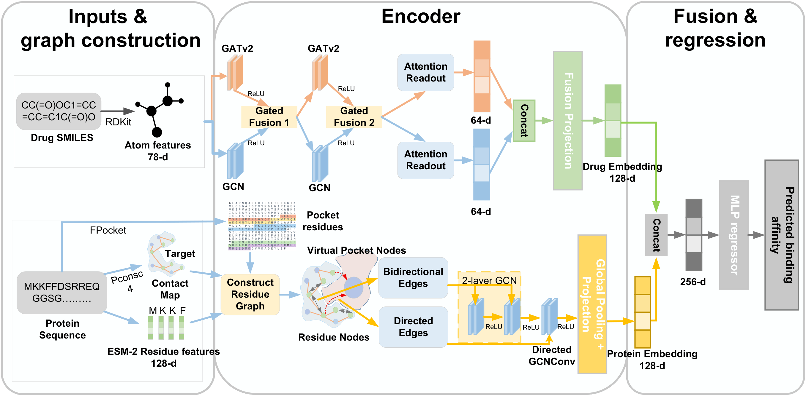
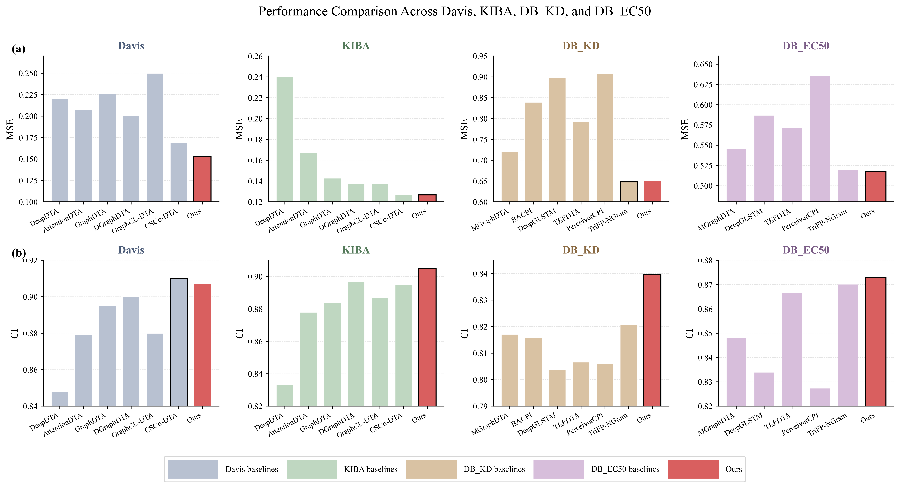
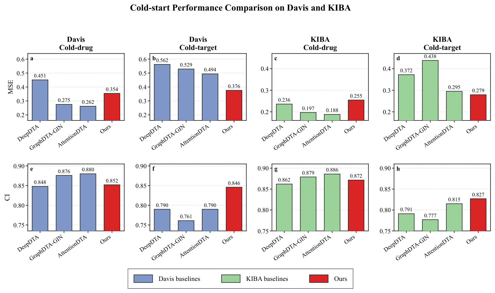
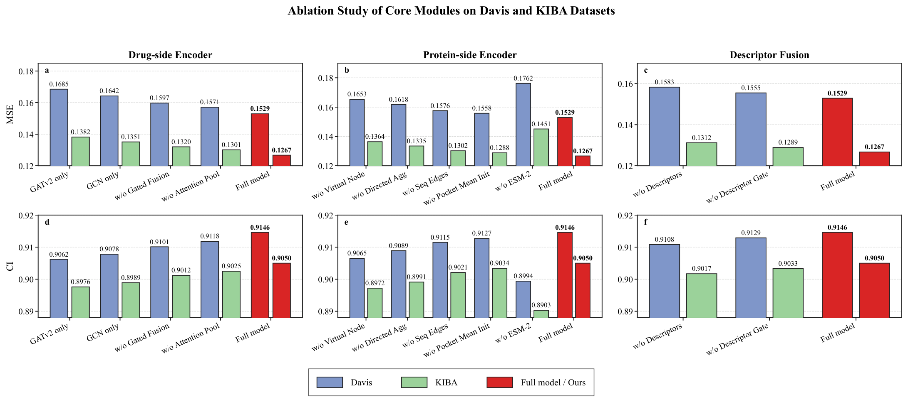
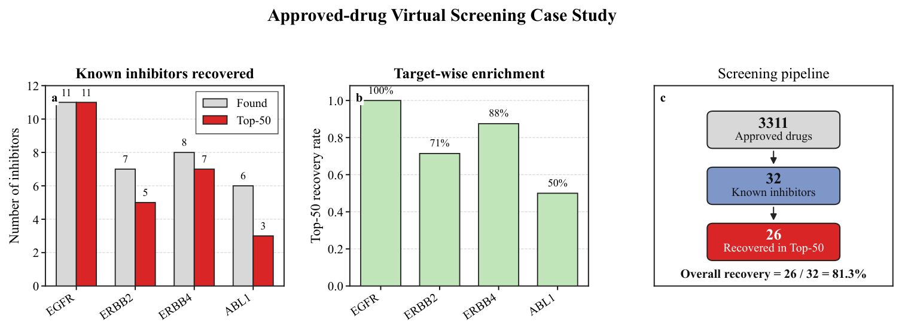

# PD-DGN

## Pocket-Aware Descriptor-Guided Dual-Gated Graph Neural Network for Drug–Target Affinity Prediction


<p align="center">

</p>


## Overview

PD-DGN is a graph neural network framework designed for drug–target affinity (DTA) prediction.

The model integrates:

- dual-view molecular graph learning;
- pocket-aware protein representation;
- physicochemical descriptor-guided fusion.

The framework contains four major components:

1. Dual-Gated Drug Encoder
2. Pocket-Aware Protein Encoder
3. Descriptor-Guided Residual Fusion
4. Affinity Regression Network


## Architecture


### Drug Encoder

Two parallel graph branches are adopted:

- **GATv2 branch** for adaptive local chemical interaction learning
- **GCN branch** for global molecular topology propagation

A bidirectional gated fusion mechanism is inserted between graph layers.


### Protein Encoder

Protein residues are represented using ESM-2 embeddings.

The protein graph incorporates:

- residue contact-map edges
- sequential residue edges
- virtual pocket nodes
- directed residue-to-pocket aggregation


### Descriptor Fusion

Twelve RDKit molecular descriptors are projected into the latent affinity space and fused through gated residual learning.


---

# Experimental Results


## Prediction Performance


<p align="center">

</p>


## Cold-start Benchmark Comparison


<p align="center">

</p>


PD-DGN is evaluated under:

- cold-drug setting
- cold-target setting


against:

- DeepDTA
- GraphDTA-GIN
- AttentionDTA


---

# Ablation Study


<p align="center">

</p>


Ablation experiments evaluate:

- GATv2 branch
- GCN branch
- gated fusion
- attention pooling
- virtual pocket nodes
- directed aggregation
- ESM-2 features
- descriptor fusion


---

# Virtual Screening Case Study


<p align="center">

</p>


Screening workflow:

```
Approved drugs
       |
Known inhibitors
       |
Top-ranked candidates
```


---

# Installation


Install dependencies:

```bash
pip install -r requirements.txt
```


Main dependencies:

```
torch
torch-geometric
rdkit
numpy
pandas
scikit-learn
networkx
transformers
esm
```


---

# Dataset


Supported datasets:


| Dataset | Affinity Type |
|---------|---------------|
| Davis | Kd |
| KIBA | Benchmark affinity score |
| DB-Kd | Dissociation constant |
| DB-EC50 | EC50 |


Required files:

```
data/
 ├── ligand structures
 ├── protein sequences
 ├── affinity matrix
 ├── ESM-2 embeddings
 ├── contact maps
 └── pocket annotations
```


---

# Training


Run training:

```bash
python run.py
```


Example configuration:

```python
dataset = "davis"

batch_size = 256

learning_rate = 5e-4

epochs = 100

dropout = 0.3
```


---

# Evaluation


Run evaluation:

```bash
python run.py
```


Metrics:

- Mean Squared Error (MSE)
- Concordance Index (CI)


---

# Citation


If you find this work useful, please cite:


```bibtex
@article{PD_DGN,
title={Drug–Target Affinity Prediction Based on Pocket-Aware Descriptor-Guided Dual-Gated Graph Neural Networks},
author={},
journal={},
year={2026}
}
```


---

# License


MIT License


# Contact


Please open an issue or contact the authors for questions.
